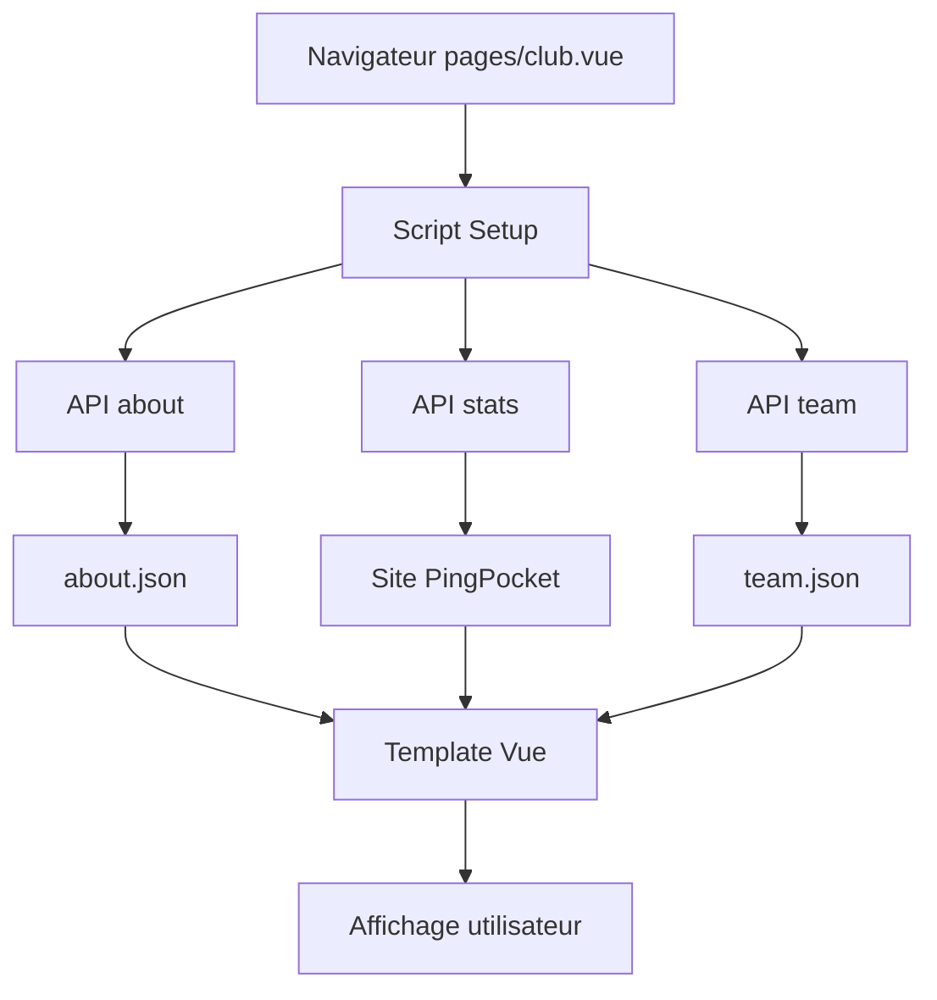
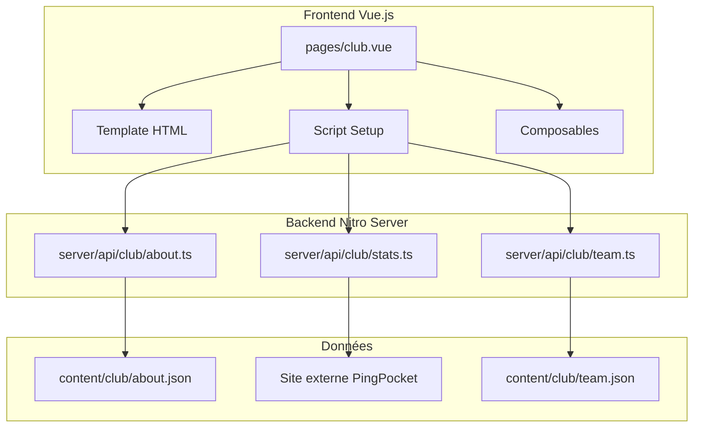
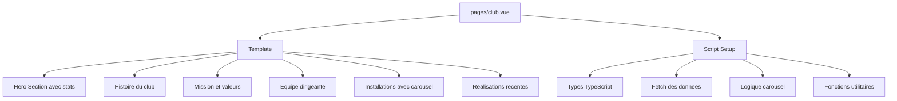
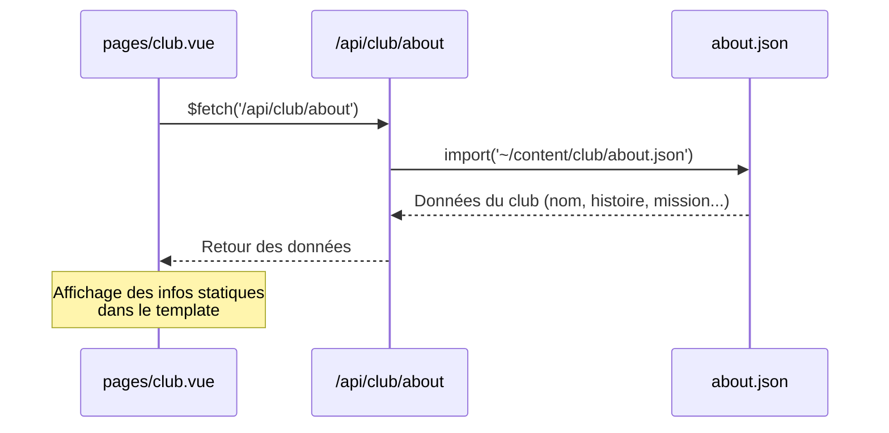
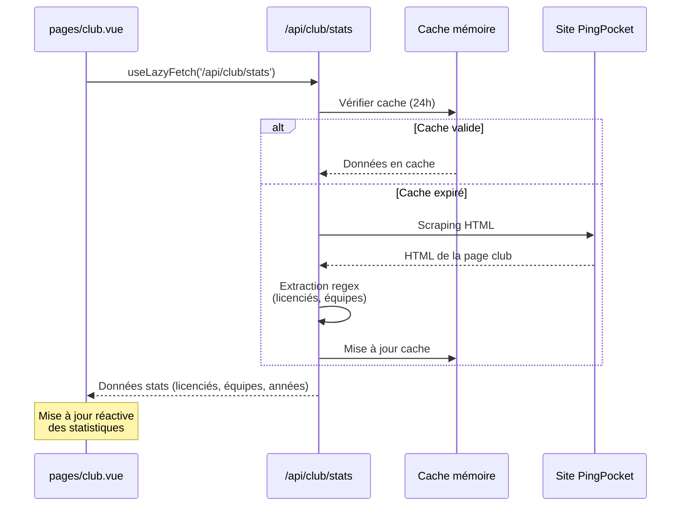
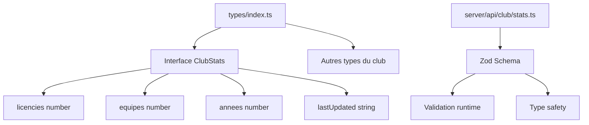
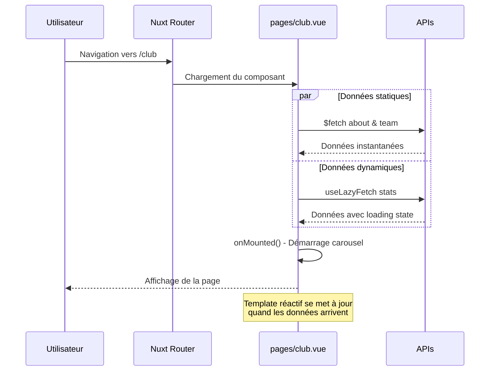
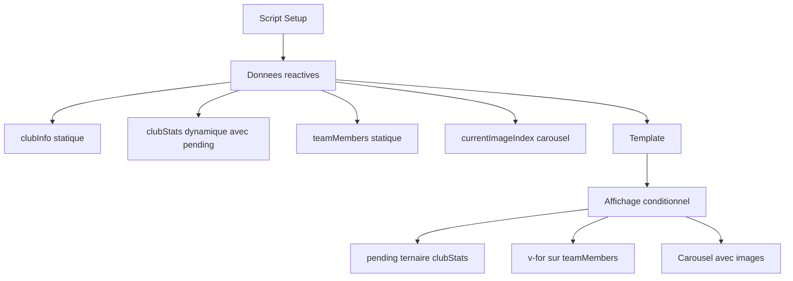

# Architecture de la page Club - Documentation Nuxt/Vue.js

## Vue d'ensemble

Cette documentation explique comment fonctionne la page `/club` dans votre application Nuxt, depuis l'affichage jusqu'à la récupération des données.

## 🔄 Flux de données global



## 🏗️ Structure de l'architecture



## 📱 Détail de la page Club

### Structure du fichier `pages/club.vue`



## 🔌 APIs et récupération de données

### 1. API About (Données statiques)



### 2. API Stats (Données dynamiques)



### 3. Composable useClubStats

```mermaid
graph LR
    A[pages/club.vue] --> B[composables/useClubStats.ts]
    B --> C[/api/club/stats]
    B --> D[Etat reactif]

    D --> D1[clubStats donnees]
    D --> D2[pending chargement]
    D --> D3[error erreurs]
    D --> D4[refresh fonction]
```

## 📦 Types et validation



## 🎨 Rendu côté client

### Lifecycle du composant



### Gestion du state réactif



## 🎯 Points clés à retenir

### 1. Différence entre les APIs

- **`$fetch`** : Exécution côté serveur (SSR), données disponibles immédiatement
- **`useLazyFetch`** : Hydratation côté client, avec état de chargement

### 2. Architecture en couches

1. **Page Vue** : Interface utilisateur et logique d'affichage
2. **API Routes** : Endpoints côté serveur pour récupérer les données
3. **Content** : Fichiers JSON statiques pour les données du club
4. **Composables** : Logique réutilisable avec gestion d'état

### 3. Types de données

- **Statiques** : Informations du club, équipe (changes peu)
- **Dynamiques** : Statistiques en temps réel (scraping externe)
- **Interactives** : State du carousel, interactions utilisateur

### 4. Performance

- Cache côté serveur (24h pour les stats)
- Lazy loading avec `useLazyFetch`
- SSR pour le contenu statique

Cette architecture permet une séparation claire des responsabilités tout en offrant une expérience utilisateur fluide avec des données toujours à jour.
