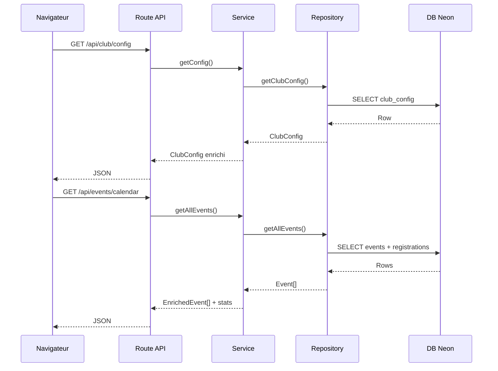

# Architecture du projet — Club Pongiste Libercourtois

## Stack technique

| Couche          | Technologie                  |
| --------------- | ---------------------------- |
| Framework       | Nuxt 4 (Vue 3, SSR)          |
| Base de données | Neon PostgreSQL (serverless) |
| ORM             | Drizzle ORM                  |
| Validation      | Zod                          |
| Style           | Tailwind CSS + @nuxt/ui      |
| Déploiement     | Netlify                      |

---

## Structure des répertoires

```text
club-pongiste-libercourtois/
├── app/                        # Frontend Nuxt 4
│   ├── pages/                  # Routes automatiques
│   ├── components/             # Composants Vue réutilisables
│   ├── composables/            # Logique réutilisable (useFetch, état)
│   ├── layouts/                # Layouts (default, admin)
│   └── middleware/             # Middleware frontend (admin.ts)
│
├── server/                     # Backend Nitro
│   ├── api/                    # Routes HTTP
│   │   ├── club/               # /api/club/*
│   │   ├── events/             # /api/events/*
│   │   ├── fftt/               # /api/fftt/* (SmartPing)
│   │   └── news/               # /api/news/*
│   ├── domains/                # Logique métier (DDD)
│   │   ├── club/               # schema, types, repository, service
│   │   ├── events/             # schema, types, repository, service
│   │   ├── competition/        # SmartPing client
│   │   ├── news/               # RSS parser
│   │   └── identity/           # Auth OIDC + Basic
│   ├── db/                     # Client DB + scripts
│   │   ├── client.ts           # Connexion Drizzle/Neon
│   │   ├── seed.ts             # Import JSON → DB (idempotent)
│   │   └── reset.ts            # Vide les tables
│   ├── middleware/             # Middleware serveur
│   │   └── auth.ts             # Protège /api/admin/*
│   └── utils/                  # Utilitaires partagés
│
├── content/                    # Données JSON source (seed uniquement)
├── drizzle/                    # Migrations SQL générées
├── schemas/                    # Schémas Zod frontend
├── types/                      # Types TypeScript partagés
└── drizzle.config.ts           # Config migrations
```

---

## Principe DDD (Domain-Driven Design)

Chaque domaine suit la même structure en 4 fichiers :

```text
server/domains/<domaine>/
├── schema.ts       # Tables Drizzle (définition DB)
├── types.ts        # Types TS + schémas Zod
├── repository.ts   # Requêtes DB (accès données pur)
└── service.ts      # Logique métier (enrichissement, calculs)
```

Les routes API sont de simples délégations au service :

```typescript
// server/api/club/config.get.ts
export default defineEventHandler(() => getConfig());
```

---

## Flux de données



---

## Domaines

### `club`

Tables : `club_config`, `club_faqs`, `club_schedules`, `club_pricing`, `club_team_members`, `club_sponsors`, `club_activities`

Routes exposées :

- `GET /api/club/config` — infos générales du club
- `GET /api/club/faq` — FAQ groupée par catégorie
- `GET /api/club/schedules-pricing` — horaires + tarifs + infos inscription
- `GET /api/club/contact` — données de contact
- `GET /api/club/licensees` — licenciés FFTT (via SmartPing)
- `GET /api/club/stats` — statistiques du club

### `events`

Tables : `events`, `event_registrations`

Routes exposées :

- `GET /api/events/calendar` — tous les événements avec statut calculé
- `GET /api/events/upcoming` — prochains événements (limite configurable)
- `POST /api/events/register` — inscription à un événement

### `competition`

Pas de table DB — données temps réel via l'API SmartPing FFTT.

- `GET /api/teams` — équipes du club avec classements
- `GET /api/club/licensees` — liste des licenciés

### `news`

Agrégation RSS externe. Pas de table DB.

- `GET /api/news/fftt` — actualités comité/ligue FFTT

### `identity`

Authentification pour les routes admin.

- OIDC via `nuxt-oidc-auth` (provider générique, compatible Authentik)
- Middleware serveur `server/middleware/auth.ts` protège `/api/admin/*`
- Middleware frontend `app/middleware/admin.ts` protège les pages `/admin/*`

---

## Base de données

### Connexion

```typescript
// server/db/client.ts
const databaseUrl =
  process.env.DATABASE_URL || process.env.NETLIFY_DATABASE_URL;
const sql = neon(databaseUrl);
export const db = drizzle(sql, { schema });
```

En local : `DATABASE_URL` dans `.env`
Sur Netlify : `NETLIFY_DATABASE_URL` injecté automatiquement par `@netlify/neon`

### Scripts DB

```bash
pnpm db:push     # Pousser le schéma (dev)
pnpm db:generate # Générer les migrations SQL
pnpm db:migrate  # Appliquer les migrations
pnpm db:seed     # Importer les JSON → DB
pnpm db:reset    # Vider les tables + reseed
pnpm db:studio   # Interface graphique Drizzle Studio
```

---

## Authentification admin

Variables d'environnement requises :

```env
NUXT_OIDC_ISSUER=https://auth.jackruby.qzz.io/application/o/libercourt-cp/
NUXT_OIDC_CLIENT_ID=<client-id>
NUXT_OIDC_CLIENT_SECRET=<client-secret>
NUXT_OIDC_SESSION_SECRET=<48-chars>
```

La protection est **manuelle** (`globalMiddlewareEnabled: false`) :

- Les pages publiques sont accessibles sans auth
- `/admin/*` déclenche le middleware OIDC
- `/api/admin/*` est protégé côté serveur

---

## Variables d'environnement

| Variable                     | Utilisation    | Contexte |
| ---------------------------- | -------------- | -------- |
| `DATABASE_URL`               | Connexion Neon | Local    |
| `NETLIFY_DATABASE_URL`       | Connexion Neon | Netlify  |
| `SMARTPING_APP_CODE`         | API FFTT       | Serveur  |
| `SMARTPING_PASSWORD`         | API FFTT       | Serveur  |
| `SMARTPING_EMAIL`            | API FFTT       | Serveur  |
| `NUXT_OIDC_ISSUER`           | Auth Authentik | Serveur  |
| `NUXT_OIDC_CLIENT_ID`        | Auth Authentik | Serveur  |
| `NUXT_OIDC_CLIENT_SECRET`    | Auth Authentik | Serveur  |
| `FACEBOOK_PAGE_ID`           | Posts Facebook | Serveur  |
| `FACEBOOK_PAGE_ACCESS_TOKEN` | Posts Facebook | Serveur  |
