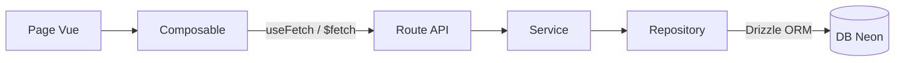

# Flux de données — Comment les pages récupèrent leurs données

## Principe général

Toutes les données viennent de la base de données Neon via des routes API.
Les composables Vue appellent ces routes avec `useFetch` ou `$fetch`.



---

## Pages et leurs sources de données

### `/` — Accueil

| Donnée             | Composable / Fetch             | Route API                  |
| ------------------ | ------------------------------ | -------------------------- |
| Événements à venir | `useUpcomingEvents()`          | `GET /api/events/upcoming` |
| Config club        | `useFetch('/api/club/config')` | `GET /api/club/config`     |
| Actualités         | `useFetch('/api/news/fftt')`   | `GET /api/news/fftt`       |

### `/club` — Le Club

| Donnée          | Source                      | Route API                                 |
| --------------- | --------------------------- | ----------------------------------------- |
| Infos générales | `$fetch('/api/club/about')` | JSON statique (`content/club/about.json`) |
| Stats           | `useClubStats()`            | `GET /api/club/stats`                     |

### `/faq` — FAQ

| Donnée                  | Composable                        | Route API           |
| ----------------------- | --------------------------------- | ------------------- |
| Questions par catégorie | `useClubFaq()` → `fetchFaqData()` | `GET /api/club/faq` |

Structure retournée :

```typescript
{
  categories: Array<{
    id: string       // 'inscription', 'tarifs', ...
    name: string     // 'Inscription & Adhésion', ...
    icon: string     // 'i-heroicons-user-plus', ...
    questions: Array<{ id: string; question: string; answer: string }>
  }>
  popular: string[]  // IDs des questions populaires
  stats: { totalQuestions, totalCategories, lastUpdated }
}
```

### `/horaires-tarifs` — Horaires & Tarifs

| Donnée           | Route API                         |
| ---------------- | --------------------------------- |
| Tout en un appel | `GET /api/club/schedules-pricing` |

Structure retournée :

```typescript
{
  schedules: ClubSchedule[]          // Liste plate (pour admin)
  pricing: ClubPricing[]             // Liste plate (pour admin)
  schedulesGrouped: {
    training: Array<{ day, sessions }>   // Groupé par jour
    competitions: Array<{ day, time, description }>
  }
  pricingGrouped: {
    annual: ClubPricing[]            // Licences (prix en €)
    reductions: ClubPricing[]        // Réductions (reductionAmount en €)
  }
  registration: { period, documents, contact }
  facilities: { address, parking, accessibility }
}
```

> **Note :** Les prix sont stockés en centimes en DB (`price = 4500` = 45€).
> Le service convertit automatiquement en euros avant de retourner les données.

### `/calendrier` — Calendrier

| Donnée              | Route API                  |
| ------------------- | -------------------------- |
| Tous les événements | `GET /api/events/calendar` |

Structure retournée :

```typescript
{
  events: EnrichedEvent[]   // avec status calculé (upcoming/ongoing/past)
  stats: { total, upcoming, past, openForRegistration }
}
```

`EnrichedEvent` ajoute ces champs calculés à l'événement DB :

- `status` : `'upcoming' | 'ongoing' | 'past'`
- `isRegistrationAvailable` : booléen calculé
- `spotsLeft` : places restantes
- `date` : alias de `startDate` (compatibilité frontend)
- `registrationOpen` : alias de `isRegistrationOpen`
- `currentParticipants` : nombre d'inscrits

### `/equipes` — Équipes

| Donnée                | Route API        |
| --------------------- | ---------------- |
| Équipes + classements | `GET /api/teams` |

Données temps réel via **SmartPing FFTT** (pas de DB).
Cache Nitro storage : 1 heure.

---

## Validation Zod

Les réponses API sont validées avec des schémas Zod dans `schemas/index.ts` :

```typescript
// Dans useUpcomingEvents.ts
const validationResult = EventsResponseSchema.safeParse(data.value);
if (!validationResult.success) {
  console.error("Validation failed:", validationResult.error);
  return { events: [] };
}
```

Les schémas sont permissifs sur les nullable/optional pour s'adapter
aux données DB (ex: `id: z.union([z.string(), z.number()])` car la DB retourne un `number`).

---

## SmartPing FFTT

L'API SmartPing est appelée pour les données de compétition :

```text
GET /api/teams
  └─► server/utils/smartping.ts (fetchTeamsWithSmartPing)
        └─► FFTT API (xml_equipe.php, xml_result_equ.php...)
              └─► Cache Nitro (1h)
```

Credentials requis dans `.env` :

```env
SMARTPING_APP_CODE=<your_app_code>
SMARTPING_PASSWORD=...
SMARTPING_EMAIL=...
```
